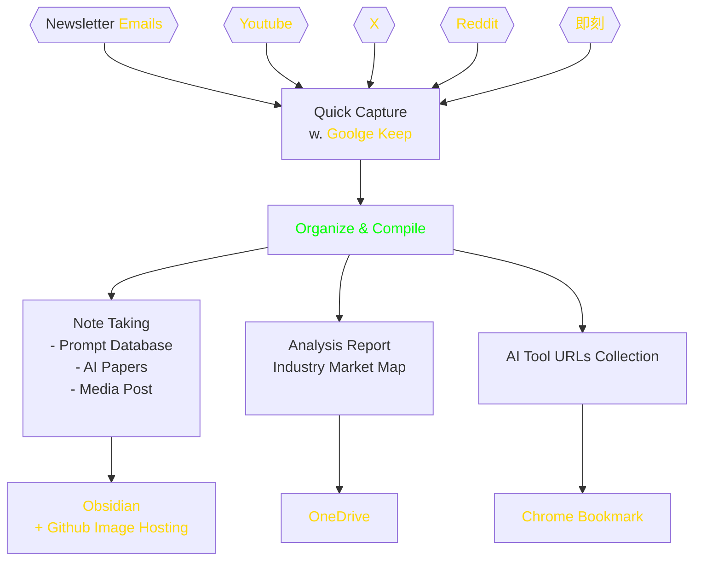

```mermaid
graph TD

A{{Newsletter <font color="#FFD700"> Emails </font>}}
B{{<font color="#FFD700"> Youtube </font>}}
C{{<font color="#FFD700"> X </font>}}
D{{<font color="#FFD700"> Reddit </font>}}
E{{<font color="#FFD700"> 即刻 </font>}}
	H[Quick Capture <br/> w. <font color="#FFD700">Goolge Keep</font>]
		L[<font color="#00ff00"> Organize & Compile </font>]
			O[Note Taking <br/> - Prompt Database <br/> - AI Papers <br/> - Media Post <br/> <br/> ]
			P[Analysis Report <br/> Industry Market Map  <br/> <br/> ]
			Q[AI Tool URLs Collection  <br/> <br/>  ]
				U[<font color="#FFD700"> Obsidian  <br/> + Github Image Hosting <br/> </font>]
				V[<font color="#FFD700"> OneDrive </font>]
				W[<font color="#FFD700"> Chrome Bookmark </font>]

A --> H
B --> H
C --> H
D --> H
E --> H
	H --> L
		L --> O --> U
		L --> P --> V
		L --> Q --> W

linkStyle default interpolate basis

```


---

Colour code remark:

```
<font color="#FFD700"> ... </font>
```

